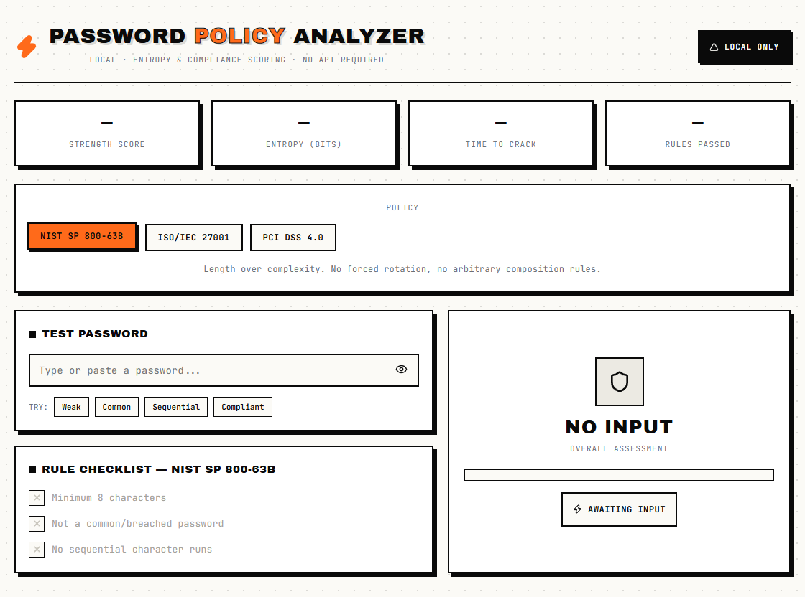
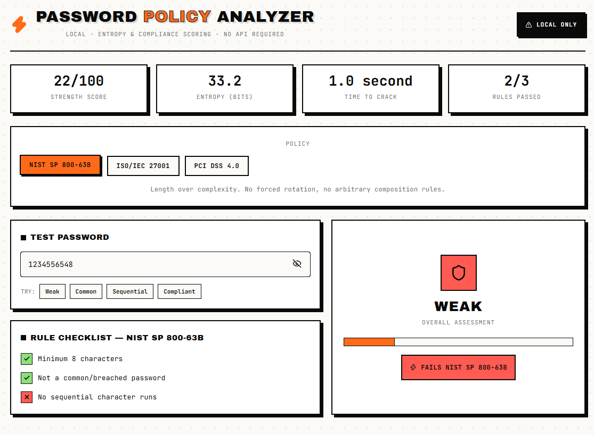
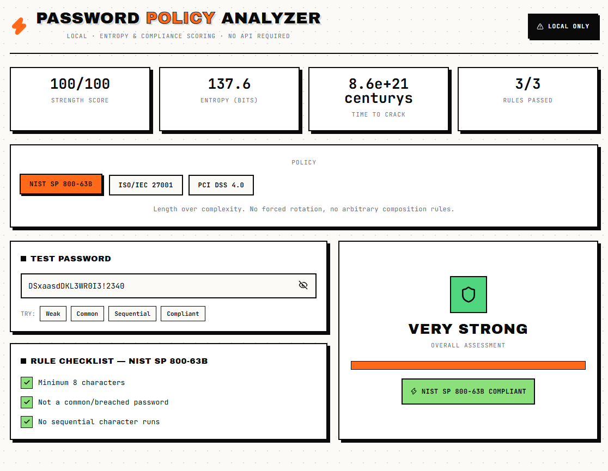

# Password Policy Analyzer

A local, client-side tool for testing password strength against real-world security standards — NIST SP 800-63B, ISO/IEC 27001, and PCI DSS 4.0. Scores entropy, estimates crack time, and checks compliance rule-by-rule. No backend, no API calls, nothing leaves the browser.



## Features

- **Live strength scoring** — entropy (bits), estimated crack time, and a 0–100 score as you type
- **Policy switching** — instantly re-check a password against NIST, ISO/IEC 27001, or PCI DSS 4.0 rules
- **Rule-by-rule checklist** — see exactly which requirements pass or fail for the selected policy
- **Common password & pattern detection** — flags breached/common passwords, sequential runs (`abcd`, `1234`), and repeated characters
- **Sample passwords** — one-click presets to see weak, common, sequential, and compliant examples
- **100% local** — all analysis runs in-browser; no password is ever sent anywhere

## Screenshots

| Weak password | Compliant password |
|---|---|
|  |  |

## Tech Stack

- [React](https://react.dev/) + [Vite](https://vitejs.dev/)
- [lucide-react](https://lucide.dev/) for icons

## Getting Started

```bash
git clone https://github.com/charukagimhan2020-hub/password-policy-analyzer.git
cd password-policy-analyzer
npm install
npm run dev
```

Then open `http://localhost:5173` in your browser.

## How Scoring Works

- **Entropy** is calculated from character pool size (lowercase, uppercase, digits, symbols) and password length.
- **Crack time** assumes an offline fast-hash attack scenario (10 billion guesses/second).
- **Score** is derived from entropy, then penalized for common/breached passwords and predictable sequences.
- **Compliance** is determined per-policy: each standard activates a different subset of rules (e.g. PCI DSS 4.0 requires 12+ characters and full character-class complexity; NIST prioritizes length alone).

## Project Structure

```
src/
  PasswordPolicyAnalyzer.jsx   # Main component — analysis logic + UI
  App.jsx                      # Renders the analyzer
  main.jsx                     # Vite entry point
```

## Disclaimer

This tool provides a simplified estimate of password strength for educational and demonstrative purposes. It should not be used as the sole basis for production authentication security decisions.

## License

MIT
